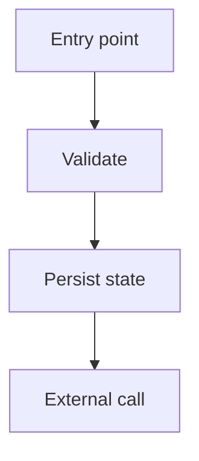
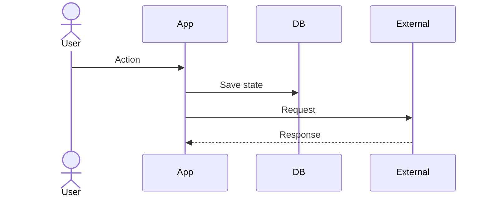
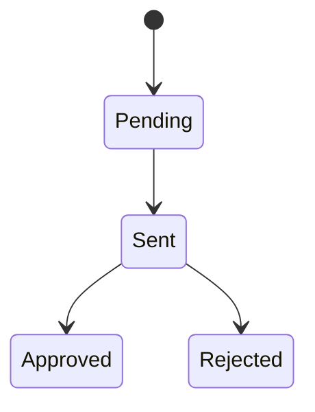
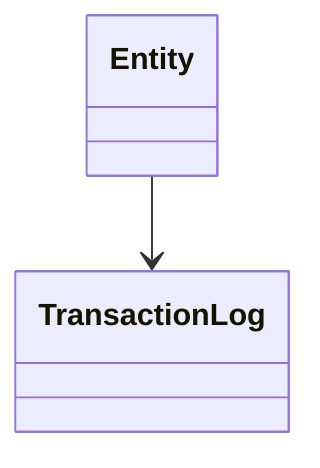

# Feature Flow Auditor

## Purpose

Produce a complete, evidence-based explanation of how a feature works, then challenge it with an independent audit. Prefer read-only analysis unless the user explicitly asks to modify code.

## Default Output

Deliver, in this order:

1. Executive summary.
2. Scope and assumptions.
3. File/component map with absolute paths.
4. Domain model/entity explanation.
5. End-to-end flow narrative.
6. Mermaid diagrams:
   - context/component diagram,
   - sequence diagram,
   - state diagram if stateful,
   - class/entity diagram when models are involved,
   - batch/job/integration diagram when async or external systems exist.
7. Key functions/classes and their responsibilities.
8. External integrations, payloads, settings/env, and failure paths.
9. Operational behavior: commands/jobs/queues/retries/logs/observability.
10. Critical audit findings prioritized from most urgent to least.
11. Quick wins vs larger refactors.
12. Open questions and validation gaps.

## Workflow

### 1. Frame the feature

Identify:

- feature/module name,
- user-visible entrypoints,
- internal modules/packages,
- external systems,
- background jobs or commands,
- persistence/state fields,
- security-sensitive data.

If scope is ambiguous, make a reasonable assumption and state it. Ask only when the wrong scope would make the analysis misleading.

### 2. Launch independent subagents when available

Use subagents only when the user explicitly asks for agents, delegation, or parallel analysis. Spawn distinct explorers with non-overlapping questions. Do not ask all agents to inspect the same thing.

Recommended agents:

- **Model/Data Explorer**: models/entities/state/relationships.
- **Entrypoints Explorer**: routes, controllers/views, forms, UI, templates, admin, public APIs.
- **Integration Explorer**: external services, payloads, env/settings, clients, middleware, error handling.
- **Operations Explorer**: jobs, commands, queues, retries, logs, observability, deployment config.
- **Critical Auditor**: after synthesis, challenge the result and prioritize improvements.

Use `references/agent-prompts.md` for ready-to-copy prompts.

While agents run, inspect non-overlapping files locally. Do not block immediately unless the next step depends on their result.

### 3. Inspect locally with source evidence

Use fast repository searches:

- filenames and directories related to the feature,
- URL/route definitions,
- model/entity definitions,
- commands/jobs/tasks,
- settings/env names,
- HTTP clients and external SDKs,
- templates/static assets,
- tests.

Record absolute paths and concrete class/function names. Prefer citing exact symbols over vague descriptions.

### 4. Build the flow model

For every major path, identify:

- trigger: user action, API call, command, cron, event, webhook,
- validator/form/schema,
- domain objects read/written,
- service/client calls,
- transaction/log/audit behavior,
- success state,
- failure state,
- retry/recovery path.

For batch systems, explicitly check whether batching is real or merely one-item async processing. Flag “one batch per item” as a design smell unless the external API requires it.

### 5. Create diagrams

Use Mermaid. Keep diagrams explanatory, not exhaustive.

Prefer these diagram types:

### 6. Run the critical audit

After the primary explanation is drafted, run a separate critical pass. It must not merely repeat the flow. It should look for:

- secrets in repo, DB, payload logs, admin screens, or runtime logs,
- authentication/authorization gaps,
- side effects on GET or unsafe endpoints,
- idempotency/concurrency issues,
- state ambiguity and missing state machine,
- retry/backoff/timeout gaps,
- duplicate legacy commands or divergent entrypoints,
- hardcoded placeholders/business constants,
- PII retention and log redaction,
- operational observability,
- testability and separation of concerns,
- real batching vs one-item batches.

Prioritize findings by risk and business impact.

### 7. Synthesize, do not dump

Integrate agent findings into a coherent explanation. Resolve contradictions by checking source code. If unresolved, label them as uncertainties.

Use headings and concise diagrams. Avoid pasting large source blocks.

## Quality Checklist

Before finalizing, verify:

- All important paths use absolute file paths.
- Every diagram maps to actual code paths.
- The flow includes both success and failure paths.
- External integrations include endpoint, payload shape, auth/secrets, and error behavior.
- State fields are explained semantically.
- Batch/queue behavior is described honestly.
- Critical improvements are ordered from urgent to less urgent.
- Quick wins are separated from major refactors.
- Security and idempotency are explicitly covered.
